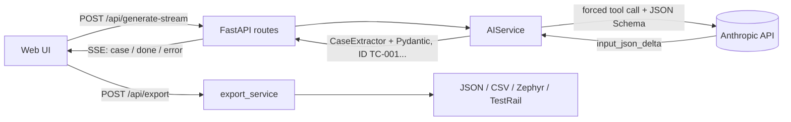

# Req2Test

[](https://github.com/KKiriln005/ai-test-case-generator/actions/workflows/ci.yml)
[](https://codecov.io/gh/KKiriln005/ai-test-case-generator)


**[English](#english)** · **[Русский](#russian)**

<a id="english"></a>

## 🇬🇧 English

**AI test-case generator from requirements and user stories.** Paste your requirements and get a structured
test suite (positive and negative scenarios, equivalence classes, boundary values) that you can export to
Zephyr Scale, TestRail, CSV or JSON.

<!-- Add a screenshot:  -->

### Features

- **Test design techniques built into the prompt:** Equivalence Partitioning, Boundary Value Analysis,
  Positive / Negative Path.
- **Guaranteed structure:** Claude is forced to call a tool whose JSON Schema comes from a Pydantic model; the
  response is validated and retried once on failure. Case fields: `ID`, `Title`, `Preconditions`, `Steps`,
  `Expected Result`, `Priority`, `Test Data`.
- **Streaming generation (SSE):** test cases appear in the UI one by one as Claude writes them; generation can
  be stopped, and an error mid-stream does not lose the cases already received.
- **Assumptions:** the model separately lists ambiguities and gaps it found in the requirements.
- **Export** to four formats, with protection against CSV/formula injection.
- **Resilience:** Anthropic API errors (401, 429, timeouts, 5xx, `max_tokens` truncation) become clear
  messages; internal details are never sent to the client.
- **Engineering basics:** tests with a mocked API, `ruff`, Docker, GitHub Actions.

### How it works



### Quick start

Requires Python 3.10+ and an [Anthropic API](https://console.anthropic.com/) key.

```bash
git clone https://github.com/KKiriln005/ai-test-case-generator.git && cd ai-test-case-generator
python -m venv .venv && source .venv/bin/activate   # Windows: .venv\Scripts\activate
pip install -r requirements.txt
cp .env.example .env                                  # set ANTHROPIC_API_KEY
uvicorn app.main:app --reload
```

UI: http://127.0.0.1:8000, Swagger: http://127.0.0.1:8000/docs.

#### Docker Compose

```bash
cp .env.example .env     # set ANTHROPIC_API_KEY
docker compose up --build
```

The container does not run as root: it uses the system user **`appuser`** (UID/GID `10001`).
The code in `/app` is owned by root and is read-only for `appuser`. If you mount a writable directory into the
container, give that UID access: `chown -R 10001:10001 <dir>`.
Check: `docker compose exec req2test whoami` → `appuser`.

#### Tests and linter

```bash
pip install -r requirements-dev.txt
ANTHROPIC_API_KEY=test pytest --cov=app    # Windows PowerShell: $env:ANTHROPIC_API_KEY="test"; pytest --cov=app
ruff check .
```

#### Manual UI testing without an API key

`scripts/fake_stream_server.py` runs the app with a fake AI service: cases arrive with a delay and no tokens
are spent. Scenarios: `ok`, `error` (failure after the 2nd case), `early` (429 before the first case),
`drop` (connection closed without `done`), `hang` (server goes silent, to test the "Stop" button).

```bash
python scripts/fake_stream_server.py error     # then open http://127.0.0.1:8000
FAKE_DELAY=2 python scripts/fake_stream_server.py ok   # slower, to watch cases appear
```

### Configuration (`.env`)

| Variable | Default | Description |
|---|---|---|
| `ANTHROPIC_API_KEY` | required | API key |
| `ANTHROPIC_MODEL` | `claude-sonnet-5-5` | model |
| `ANTHROPIC_MAX_TOKENS` | `8000` | response token limit |
| `ANTHROPIC_TIMEOUT_S` | `90` | request timeout, seconds |
| `ANTHROPIC_MAX_RETRIES` | `2` | network / 429 / 5xx retries inside the SDK |

### Export formats

| Format | Structure | Use for |
|---|---|---|
| **JSON** | full suite including `summary` and `assumptions` | integrations, further processing |
| **CSV Standard** | one case = one row, steps numbered in a single cell | Excel, Google Sheets, review |
| **Zephyr Scale CSV** | one step = one row; `Critical` → `High`, status `Draft` | import into Zephyr Scale |
| **TestRail CSV** | one step = one row; test data inside the first step | import into TestRail (Test Case Steps template) |

> Both tools show a column-mapping wizard on import. Do your first import into a sandbox project.

### API

| Method and path | Purpose |
|---|---|
| `POST /api/generate` | generate a test suite |
| `POST /api/generate-stream` | the same as an SSE stream (see [docs/streaming.md](docs/streaming.md)) |
| `POST /api/export` | export a suite in the chosen format |
| `GET /health` | liveness check |

### Project structure

```
app/
├── main.py              # app, error handling
├── config.py            # settings from .env
├── schemas.py           # Pydantic schemas (contract for the API, the model and export)
├── prompts.py           # system prompt
├── api/                 # routes and dependencies
├── core/exceptions.py   # domain errors with HTTP statuses
├── services/
│   ├── ai_service.py    # Claude call, validation, retries, streaming
│   ├── stream_parser.py # parsing partial JSON from the stream
│   └── export_service.py
└── templates/index.html
tests/                   # pytest, Anthropic is mocked
scripts/                 # fake_stream_server.py - local stand for manual UI testing
docs/streaming.md        # SSE design (in Russian)
```

### Roadmap

- [x] SSE streaming in the UI
- [ ] Import requirements from Jira / Confluence
- [ ] Generation history and suite version comparison

### License

MIT, see [LICENSE](LICENSE).

---

<a id="russian"></a>

## 🇷🇺 Русский

**AI-генератор тест-кейсов из требований и User Stories.** Вставьте требования, получите структурированный набор
тест-кейсов (позитивные и негативные сценарии, эквивалентные классы, граничные значения) и выгрузите его в
Zephyr Scale, TestRail, CSV или JSON.

### Возможности

- **Техники тест-дизайна в промпте:** Equivalence Partitioning, Boundary Value Analysis, Positive / Negative Path.
- **Гарантированная структура:** Claude вызывает tool с JSON Schema из Pydantic-модели, ответ валидируется,
  при сбое один повтор. Поля кейса: `ID`, `Title`, `Preconditions`, `Steps`, `Expected Result`, `Priority`, `Test Data`.
- **Потоковая генерация (SSE):** кейсы появляются в интерфейсе по одному, по мере того как Claude их пишет;
  генерацию можно остановить, ошибка посреди потока не теряет уже полученные кейсы.
- **Допущения:** модель отдельно перечисляет неясности и пробелы в требованиях.
- **Экспорт** в четыре формата, защита от CSV/Formula Injection.
- **Надёжность:** ошибки Anthropic API (401, 429, таймауты, 5xx, обрезка по `max_tokens`) превращаются в понятные
  ответы, внутренние детали клиенту не отдаются.
- **Инженерная база:** тесты с замоканным API, `ruff`, Docker, GitHub Actions.

### Как это работает


### Быстрый старт

Нужен Python 3.10+ и ключ [Anthropic API](https://console.anthropic.com/).

```bash
git clone https://github.com/KKiriln005/ai-test-case-generator.git && cd ai-test-case-generator
python -m venv .venv && source .venv/bin/activate   # Windows: .venv\Scripts\activate
pip install -r requirements.txt
cp .env.example .env                                  # впишите ANTHROPIC_API_KEY
uvicorn app.main:app --reload
```

Интерфейс: http://127.0.0.1:8000, Swagger: http://127.0.0.1:8000/docs.

#### Docker Compose

```bash
cp .env.example .env     # впишите ANTHROPIC_API_KEY
docker compose up --build
```

Контейнер работает не от root, а от системного пользователя **`appuser`** (UID/GID `10001`).
Код в `/app` принадлежит root и доступен `appuser` только на чтение. Если монтируете в контейнер
каталог с правом записи, выдайте права этому UID: `chown -R 10001:10001 <каталог>`.
Проверка: `docker compose exec req2test whoami` → `appuser`.

#### Тесты и линтер

```bash
pip install -r requirements-dev.txt
ANTHROPIC_API_KEY=test pytest --cov=app    # Windows PowerShell: $env:ANTHROPIC_API_KEY="test"; pytest --cov=app
ruff check .
```

#### Ручная проверка интерфейса без API-ключа

`scripts/fake_stream_server.py` запускает приложение с фейковым AI-сервисом: кейсы приходят с паузой,
токены не тратятся. Сценарии: `ok`, `error` (сбой после 2-го кейса), `early` (429 до первого кейса),
`drop` (обрыв без `done`), `hang` (зависание - проверка кнопки «Остановить»).

```bash
python scripts/fake_stream_server.py error     # затем открыть http://127.0.0.1:8000
FAKE_DELAY=2 python scripts/fake_stream_server.py ok   # медленнее, чтобы рассмотреть появление кейсов
```

### Конфигурация (`.env`)

| Переменная | По умолчанию | Описание |
|---|---|---|
| `ANTHROPIC_API_KEY` | обязательна | ключ API |
| `ANTHROPIC_MODEL` | `claude-sonnet-5-5` | модель |
| `ANTHROPIC_MAX_TOKENS` | `8000` | лимит токенов ответа |
| `ANTHROPIC_TIMEOUT_S` | `90` | таймаут запроса, сек |
| `ANTHROPIC_MAX_RETRIES` | `2` | ретраи сети / 429 / 5xx внутри SDK |

### Форматы экспорта

| Формат | Структура | Для чего |
|---|---|---|
| **JSON** | полный набор вместе с `summary` и `assumptions` | интеграции, дальнейшая обработка |
| **CSV Standard** | один кейс = одна строка, шаги в одной ячейке с нумерацией | Excel, Google Sheets, ревью |
| **Zephyr Scale CSV** | один шаг = одна строка; `Critical` → `High`, статус `Draft` | импорт в Zephyr Scale |
| **TestRail CSV** | один шаг = одна строка; тестовые данные внутри первого шага | импорт в TestRail (шаблон Test Case Steps) |

> Обе системы при импорте показывают мастер сопоставления колонок. Первый импорт стоит сделать на пробном проекте.

### API

| Метод и путь | Назначение |
|---|---|
| `POST /api/generate` | сгенерировать набор тест-кейсов |
| `POST /api/generate-stream` | то же потоком SSE (см. [docs/streaming.md](docs/streaming.md)) |
| `POST /api/export` | выгрузить набор в выбранном формате |
| `GET /health` | проверка живости |

### Структура проекта

```
app/
├── main.py              # приложение, обработка ошибок
├── config.py            # настройки из .env
├── schemas.py           # Pydantic-схемы (контракт для API, модели и экспорта)
├── prompts.py           # системный промпт
├── api/                 # роуты и зависимости
├── core/exceptions.py   # доменные ошибки с HTTP-статусами
├── services/
│   ├── ai_service.py    # вызов Claude, валидация, ретраи, стриминг
│   ├── stream_parser.py # разбор частичного JSON потока
│   └── export_service.py
└── templates/index.html
tests/                   # pytest, Anthropic замокан
scripts/                 # fake_stream_server.py - стенд для ручной проверки UI
docs/streaming.md        # концепция SSE
```

### Roadmap

- [x] Подключить SSE-стриминг в UI
- [ ] Импорт требований из Jira / Confluence
- [ ] История генераций и сравнение версий наборов

### Лицензия

MIT, см. [LICENSE](LICENSE).
