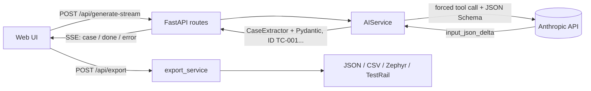

# Req2Test

[](https://github.com/KKiriln005/ai-test-case-generator/actions/workflows/ci.yml)
[](https://codecov.io/gh/KKiriln005/ai-test-case-generator)


**[English](#english)** · **[Українська](#ukrainian)**

<a id="english"></a>

## 🇬🇧 English

**AI test-case generator from requirements and user stories.** Paste your requirements and get a structured
test suite (positive and negative scenarios, equivalence classes, boundary values) that you can export to
Zephyr Scale, TestRail, CSV or JSON.

<!-- Add a screenshot:  -->

### Features

- **Test design techniques built into the prompt:** Equivalence Partitioning, Boundary Value Analysis,
  Positive / Negative Path.
- **Guaranteed structure:** Claude is forced to call a tool whose JSON Schema comes from a Pydantic model; the
  response is validated and retried once on failure. Case fields: `ID`, `Title`, `Preconditions`, `Steps`,
  `Expected Result`, `Priority`, `Test Data`.
- **Streaming generation (SSE):** test cases appear in the UI one by one as Claude writes them; generation can
  be stopped, and an error mid-stream does not lose the cases already received.
- **Assumptions:** the model separately lists ambiguities and gaps it found in the requirements.
- **Export** to four formats, with protection against CSV/formula injection.
- **Resilience:** Anthropic API errors (401, 429, timeouts, 5xx, `max_tokens` truncation) become clear
  messages; internal details are never sent to the client.
- **Engineering basics:** tests with a mocked API, `ruff`, Docker, GitHub Actions.

### How it works



### Quick start

Requires Python 3.10+ and an [Anthropic API](https://console.anthropic.com/) key.

```bash
git clone https://github.com/KKiriln005/ai-test-case-generator.git && cd ai-test-case-generator
python -m venv .venv && source .venv/bin/activate   # Windows: .venv\Scripts\activate
pip install -r requirements.txt
cp .env.example .env                                  # set ANTHROPIC_API_KEY
uvicorn app.main:app --reload
```

UI: http://127.0.0.1:8000, Swagger: http://127.0.0.1:8000/docs.

#### Docker Compose

```bash
cp .env.example .env     # set ANTHROPIC_API_KEY
docker compose up --build
```

The container does not run as root: it uses the system user **`appuser`** (UID/GID `10001`).
The code in `/app` is owned by root and is read-only for `appuser`. If you mount a writable directory into the
container, give that UID access: `chown -R 10001:10001 <dir>`.
Check: `docker compose exec req2test whoami` → `appuser`.

#### Tests and linter

```bash
pip install -r requirements-dev.txt
ANTHROPIC_API_KEY=test pytest --cov=app    # Windows PowerShell: $env:ANTHROPIC_API_KEY="test"; pytest --cov=app
ruff check .
```

#### Manual UI testing without an API key

`scripts/fake_stream_server.py` runs the app with a fake AI service: cases arrive with a delay and no tokens
are spent. Scenarios: `ok`, `error` (failure after the 2nd case), `early` (429 before the first case),
`drop` (connection closed without `done`), `hang` (server goes silent, to test the "Stop" button).

```bash
python scripts/fake_stream_server.py error     # then open http://127.0.0.1:8000
FAKE_DELAY=2 python scripts/fake_stream_server.py ok   # slower, to watch cases appear
```

### Configuration (`.env`)

| Variable | Default | Description |
|---|---|---|
| `ANTHROPIC_API_KEY` | required | API key |
| `ANTHROPIC_MODEL` | `claude-sonnet-5-5` | model |
| `ANTHROPIC_MAX_TOKENS` | `8000` | response token limit |
| `ANTHROPIC_TIMEOUT_S` | `90` | request timeout, seconds |
| `ANTHROPIC_MAX_RETRIES` | `2` | network / 429 / 5xx retries inside the SDK |

### Export formats

| Format | Structure | Use for |
|---|---|---|
| **JSON** | full suite including `summary` and `assumptions` | integrations, further processing |
| **CSV Standard** | one case = one row, steps numbered in a single cell | Excel, Google Sheets, review |
| **Zephyr Scale CSV** | one step = one row; `Critical` → `High`, status `Draft` | import into Zephyr Scale |
| **TestRail CSV** | one step = one row; test data inside the first step | import into TestRail (Test Case Steps template) |

> Both tools show a column-mapping wizard on import. Do your first import into a sandbox project.

### API

| Method and path | Purpose |
|---|---|
| `POST /api/generate` | generate a test suite |
| `POST /api/generate-stream` | the same as an SSE stream (see [docs/streaming.md](docs/streaming.md)) |
| `POST /api/export` | export a suite in the chosen format |
| `GET /health` | liveness check |

### Project structure

```
app/
├── main.py              # app, error handling
├── config.py            # settings from .env
├── schemas.py           # Pydantic schemas (contract for the API, the model and export)
├── prompts.py           # system prompt
├── api/                 # routes and dependencies
├── core/exceptions.py   # domain errors with HTTP statuses
├── services/
│   ├── ai_service.py    # Claude call, validation, retries, streaming
│   ├── stream_parser.py # parsing partial JSON from the stream
│   └── export_service.py
└── templates/index.html
tests/                   # pytest, Anthropic is mocked
scripts/                 # fake_stream_server.py - local stand for manual UI testing
docs/streaming.md        # SSE design (in Ukrainian)
```

### Roadmap

- [x] SSE streaming in the UI
- [ ] Import requirements from Jira / Confluence
- [ ] Generation history and suite version comparison

### License

MIT, see [LICENSE](LICENSE).

---

<a id="ukrainian"></a>

## 🇺🇦 Українська

**AI-генератор тест-кейсів з вимог і User Stories.** Вставте вимоги, отримайте структурований набір
тест-кейсів (позитивні та негативні сценарії, класи еквівалентності, граничні значення) і вивантажте його в
Zephyr Scale, TestRail, CSV або JSON.

### Можливості

- **Техніки тест-дизайну в промпті:** Equivalence Partitioning, Boundary Value Analysis, Positive / Negative Path.
- **Гарантована структура:** Claude викликає tool з JSON Schema з Pydantic-моделі, відповідь валідується,
  у разі збою один повтор. Поля кейса: `ID`, `Title`, `Preconditions`, `Steps`, `Expected Result`, `Priority`, `Test Data`.
- **Потокова генерація (SSE):** кейси з'являються в інтерфейсі по одному, у міру того як Claude їх пише;
  генерацію можна зупинити, помилка посеред потоку не втрачає вже отримані кейси.
- **Припущення:** модель окремо перелічує неясності та прогалини у вимогах.
- **Експорт** у чотири формати, захист від CSV/Formula Injection.
- **Надійність:** помилки Anthropic API (401, 429, таймаути, 5xx, обрізання за `max_tokens`) перетворюються на зрозумілі
  відповіді, внутрішні деталі клієнту не віддаються.
- **Інженерна база:** тести із замоканим API, `ruff`, Docker, GitHub Actions.

### Як це працює


### Швидкий старт

Потрібен Python 3.10+ і ключ [Anthropic API](https://console.anthropic.com/).

```bash
git clone https://github.com/KKiriln005/ai-test-case-generator.git && cd ai-test-case-generator
python -m venv .venv && source .venv/bin/activate   # Windows: .venv\Scripts\activate
pip install -r requirements.txt
cp .env.example .env                                  # впишіть ANTHROPIC_API_KEY
uvicorn app.main:app --reload
```

Інтерфейс: http://127.0.0.1:8000, Swagger: http://127.0.0.1:8000/docs.

#### Docker Compose

```bash
cp .env.example .env     # впишіть ANTHROPIC_API_KEY
docker compose up --build
```

Контейнер працює не від root, а від системного користувача **`appuser`** (UID/GID `10001`).
Код у `/app` належить root і доступний `appuser` лише для читання. Якщо монтуєте в контейнер
каталог із правом запису, надайте права цьому UID: `chown -R 10001:10001 <каталог>`.
Перевірка: `docker compose exec req2test whoami` → `appuser`.

#### Тести та лінтер

```bash
pip install -r requirements-dev.txt
ANTHROPIC_API_KEY=test pytest --cov=app    # Windows PowerShell: $env:ANTHROPIC_API_KEY="test"; pytest --cov=app
ruff check .
```

#### Ручна перевірка інтерфейсу без API-ключа

`scripts/fake_stream_server.py` запускає застосунок з фейковим AI-сервісом: кейси приходять з паузою,
токени не витрачаються. Сценарії: `ok`, `error` (збій після 2-го кейса), `early` (429 до першого кейса),
`drop` (обрив без `done`), `hang` (зависання - перевірка кнопки «Зупинити генерацію»).

```bash
python scripts/fake_stream_server.py error     # потім відкрити http://127.0.0.1:8000
FAKE_DELAY=2 python scripts/fake_stream_server.py ok   # повільніше, щоб роздивитися появу кейсів
```

### Конфігурація (`.env`)

| Змінна | За замовчуванням | Опис |
|---|---|---|
| `ANTHROPIC_API_KEY` | обов'язкова | ключ API |
| `ANTHROPIC_MODEL` | `claude-sonnet-5-5` | модель |
| `ANTHROPIC_MAX_TOKENS` | `8000` | ліміт токенів відповіді |
| `ANTHROPIC_TIMEOUT_S` | `90` | таймаут запиту, с |
| `ANTHROPIC_MAX_RETRIES` | `2` | ретраї мережі / 429 / 5xx усередині SDK |

### Формати експорту

| Формат | Структура | Для чого |
|---|---|---|
| **JSON** | повний набір разом із `summary` і `assumptions` | інтеграції, подальша обробка |
| **CSV Standard** | один кейс = один рядок, кроки в одній комірці з нумерацією | Excel, Google Sheets, рев'ю |
| **Zephyr Scale CSV** | один крок = один рядок; `Critical` → `High`, статус `Draft` | імпорт у Zephyr Scale |
| **TestRail CSV** | один крок = один рядок; тестові дані всередині першого кроку | імпорт у TestRail (шаблон Test Case Steps) |

> Обидві системи під час імпорту показують майстер зіставлення колонок. Перший імпорт варто зробити в пробному проєкті.

### API

| Метод і шлях | Призначення |
|---|---|
| `POST /api/generate` | згенерувати набір тест-кейсів |
| `POST /api/generate-stream` | те саме потоком SSE (див. [docs/streaming.md](docs/streaming.md)) |
| `POST /api/export` | вивантажити набір у вибраному форматі |
| `GET /health` | перевірка живості |

### Структура проєкту

```
app/
├── main.py              # застосунок, обробка помилок
├── config.py            # налаштування з .env
├── schemas.py           # Pydantic-схеми (контракт для API, моделі та експорту)
├── prompts.py           # системний промпт
├── api/                 # роути та залежності
├── core/exceptions.py   # доменні помилки з HTTP-статусами
├── services/
│   ├── ai_service.py    # виклик Claude, валідація, ретраї, стримінг
│   ├── stream_parser.py # розбір часткового JSON потоку
│   └── export_service.py
└── templates/index.html
tests/                   # pytest, Anthropic замокано
scripts/                 # fake_stream_server.py - стенд для ручної перевірки UI
docs/streaming.md        # концепція SSE
```

### Roadmap

- [x] Підключити SSE-стримінг в UI
- [ ] Імпорт вимог з Jira / Confluence
- [ ] Історія генерацій і порівняння версій наборів

### Ліцензія

MIT, див. [LICENSE](LICENSE).
